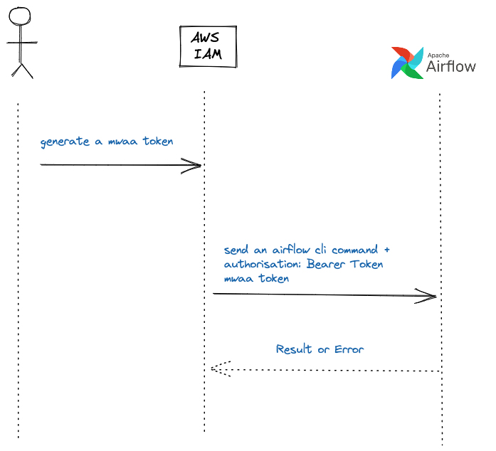

# mwaa_cli 

## Introduction

Amazon Managed Workflows for [Apache Airflow](https://airflow.apache.org/) ([MWAA](https://docs.aws.amazon.com/mwaa/latest/userguide/what-is-mwaa.html)) is a managed orchestration service for Apache Airflow. It is a fully managed service that makes it easy to create, schedule, and monitor workflows.

This project is a **command line interface** for [MWAA](https://docs.aws.amazon.com/mwaa/latest/userguide/what-is-mwaa.html). It is a wrapper around the [AWS CLI](https://aws.amazon.com/cli/) and [curl](https//curl.se) commands.

## Installation

### Prerequisites

- [jq](https://stedolan.github.io/jq/)
- [curl](https://curl.se/)
- [aws-cli](https://aws.amazon.com/cli/)

### Install

Just copy and add the [`mwaa_cli.sh`](https://raw.githubusercontent.com/raphaelmansuy/mwaa_cli/main/mwaa_cli.sh) script to your path.

For example:

```bash
curl -s https://raw.githubusercontent.com/raphaelmansuy/mwaa_cli/main/mwaa_cli.sh -o /usr/local/bin/mwaa_cli.sh
chmod +x /usr/local/bin/mwaa_cli.sh
```

## How to use

```bash
Usage: mwaa_cli.sh <command> <args>(<options>)

Options:

  -h, --help: Display this help
  -e, --environment: Set the MWAA environment name (example: airflow_env_1)
  -r, --region: Set the AWS region (example: eu-west-1)
  -p, --profile: Set the AWS CLI profile (example: saml)

Examples:

mwaa_cli.sh dags list
mwaa_cli.sh dags list-runs -d <dag_id>
mwaa_cli.sh list_tasks <dag_id>
mwaa_cli.sh trigger_dag <dag_id>
mwaa_cli.sh dags pause <dag_id>
mwaa_cli.sh dags unpause <dag_id>

```

### Frequently used commands

#### List DAGs

```bash
mwaa_cli.sh dags list
```

#### List DAG runs

```bash
mwaa_cli.sh dags list-runs -d <dag_id>
```

#### Trigger DAG

```bash
mwaa_cli.sh trigger_dag <dag_id>
```

#### Pause DAG

```bash
mwaa_cli.sh dags pause <dag_id>
```

#### Unpause DAG

```bash
mwaa_cli.sh dags unpause <dag_id>
```

#### List dags and display with a specific format (JSON, YAML, CSV, TSV, table)

```bash
mwaa_cli.sh dags list --output json | jq
```

#### List all dags that are not paused

```bash
./mwaa_cli.sh dags list --output json | jq '.[] | select(.paused == "False")'
```

#### Execute a command for each dag that is not paused

```bash
./mwaa_cli.sh dags list --output json  | jq '.[] | select(.paused == "False") .dag_id' | tr '\n' '\0' | xargs -0 -n1 echo
``` 

#### Pause all dags that are not paused

```bash
./mwaa_cli.sh dags list --output json | jq '.[] | select(.paused == "False") | .dag_id' | tr '\n' '\0' | xargs -0 -n1 ./mwaa_cli.sh dags pause 
```

#### Unpause all dags that are paused

```bash
./mwaa_cli.sh dags list --output json | jq '.[] | select(.paused == "True") | .dag_id' | tr '\n' '\0' | xargs -0 -n1 ./mwaa_cli.sh dags unpause 
```

### How it works

The script uses the [AWS CLI](https://aws.amazon.com/cli/) to get the MWAA environment details (endpoint, IAM role, etc.). It then uses [curl](https://curl.se/) to call the MWAA API.



Reference of AirFlow commands [https://airflow.apache.org/docs/apache-airflow/stable/cli-and-env-variables-ref.html#cli-commands](https://airflow.apache.org/docs/apache-airflow/stable/cli-and-env-variables-ref.html#cli-commands)
)


Created with love ❤️ by [Raphaël MANSUY](https://www.linkedin.com/in/raphaelmansuy/)
